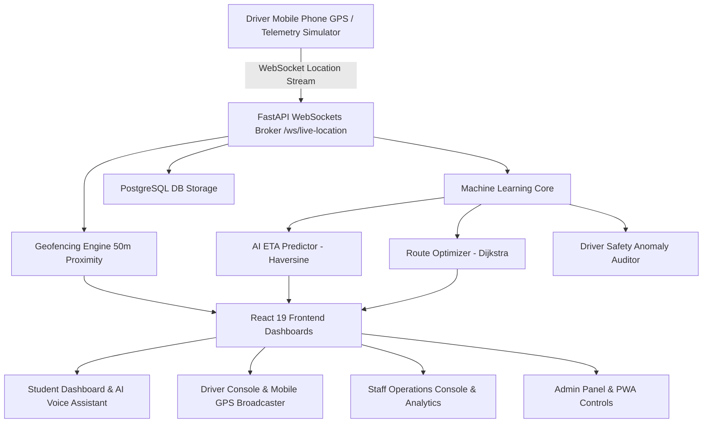

# IntelliBus AI Platform - Technical Documentation & System Guide

Comprehensive architectural manual, flowchart diagrams, setup guide, security status, and technology breakdown.

---

## 1. Executive Summary

**IntelliBus AI** is an enterprise-grade campus transportation intelligence system built to deliver sub-second vehicle telemetry, AI-driven arrival countdowns (ETA), Dijkstra shortest-path route optimization, automated stop geofence detection, driver safety monitoring, digital QR boarding validation, and role-based operational dashboards.

---

## 2. System Architecture & Flowchart



### Text Flowchart Architecture:
```text
+---------------------------------------------------------------------------------------------------+
|                                  INTELLIBUS AI SYSTEM ARCHITECTURE                                |
+---------------------------------------------------------------------------------------------------+
                                                  |
           +--------------------------------------+--------------------------------------+
           |                                                                             |
 [Driver Mobile Phone GPS]                                                     [Telemetry Simulator]
 (HTML5 Geolocation API)                                                       (ml/telemetry_simulator.py)
           |                                                                             |
           +--------------------------------------+--------------------------------------+
                                                  |
                                        WebSocket Connection
                                    /ws/live-location/{trip_id}
                                                  |
                                                  v
                                +-----------------------------------+
                                | FastAPI Telemetry Broker          |
                                | (ConnectionManager & Broadcast)   |
                                +-----------------------------------+
                                                  |
           +--------------------------------------+--------------------------------------+
           |                                      |                                      |
           v                                      v                                      v
  [Geofence Engine]                     [Machine Learning Engine]                 [PostgreSQL DB]
 (50m Proximity Check)                  - ETA Predictor (Haversine)               - Users, Buses
 (backend/app/geofence.py)              - Route Optimizer (Dijkstra)              - Routes, Trips
                                        - Driver Safety Auditor                   - GPS Logs, Alerts
           |                                      |                                      |
           +--------------------------------------+--------------------------------------+
                                                  |
                                                  v
                                +-----------------------------------+
                                | React 19 Frontend User Dashboards |
                                | - Student (Map, ETA, AI Voice, QR)|
                                | - Driver (Console, GPS Broadcaster|
                                | - Staff (Fleet Ops, Analytics)    |
                                | - Admin (Fleet Config, Users, PWA)|
                                +-----------------------------------+
```

---

## 3. How to Run the Project

### One-Click Launch Commands:

```powershell
# Windows Command Prompt (Root Directory)
.\start.bat

# Windows PowerShell (Root Directory)
.\start.ps1
```

### Endpoints & Ports:

| Service Component | URL / Endpoint | Description |
| :--- | :--- | :--- |
| **Frontend Application** | `http://localhost:5173` | React 19 + Vite UI |
| **Backend API Docs** | `http://localhost:8000/api/v1/openapi.json` | Swagger / OpenAPI Specs |
| **WebSocket Telemetry** | `ws://localhost:8000/ws/live-location/{trip_id}` | Sub-second GPS Location Stream |

### Default Demo Credentials:

| Role | Email | Password | Capabilities |
| :--- | :--- | :--- | :--- |
| **Student** | `student@campus.edu` | `password123` | Live Map, AI ETA, Express QR Pass, Journey Planner, Voice Assistant |
| **Driver** | `driver@campus.edu` | `password123` | Trip Console, Mobile Hardware GPS Broadcaster, Passenger Counter |
| **Staff / Dispatcher** | `staff@campus.edu` | `password123` | Fleet Operations, Multi-Bus Map, Peak Passenger Analytics, Alerts |
| **Administrator** | `admin@campus.edu` | `password123` | Fleet Roster, Route Config, User Directory, DB Seeder, PWA Controls |

---

## 4. Security Architecture & Compliance

- **Authentication Standard**: OAuth2 JSON Web Token (JWT) using HS256 algorithm and 7-day token expiration.
- **Cryptographic Password Hashing**: PBKDF2-HMAC-SHA256 with 100,000 iterations and dedicated salt key.
- **Role-Based Access Control (RBAC)**: Enforced at both FastAPI dependency levels (backend) and React Router protected route wrappers (`student`, `driver`, `staff`, `admin`).
- **CORS & Request Security**: Configured middleware headers preventing cross-site scripting (XSS) and request forgery.

---

## 5. Enterprise Feature Additions & Production Roadmap

- **PostGIS Spatial Database Integration**: Enabled PostGIS spatial indexing (`ST_DWithin`, `ST_Distance`) in [geofence.py](file:///c:/Users/lovel/OneDrive/Desktop/Intellibus%20project/backend/app/geofence.py) with automatic SQLite dev fallback.
- **ML Traffic Heatmap & Congestion Predictor**: Created [traffic_model.py](file:///c:/Users/lovel/OneDrive/Desktop/Intellibus%20project/ml/traffic_model.py) delivering 24-hour campus traffic delay predictions and dynamic ETA adjustments via `/api/v1/ai/traffic-heatmap`.
- **PWA Offline Service Worker & Push Notifications**: Configured service worker [sw.js](file:///c:/Users/lovel/OneDrive/Desktop/Intellibus%20project/frontend/public/sw.js), web app manifest [manifest.json](file:///c:/Users/lovel/OneDrive/Desktop/Intellibus%20project/frontend/public/manifest.json), and browser Push Notification service [notificationService.ts](file:///c:/Users/lovel/OneDrive/Desktop/Intellibus%20project/frontend/src/services/notificationService.ts).
- **Automated Testing & GitHub Actions CI/CD**: Added Pytest test suite in [test_api.py](file:///c:/Users/lovel/OneDrive/Desktop/Intellibus%20project/backend/tests/test_api.py) and CI workflow in [.github/workflows/ci.yml](file:///c:/Users/lovel/OneDrive/Desktop/Intellibus%20project/.github/workflows/ci.yml).
- **IoT Hardware OBD-II / MQTT Telemetry Ingestion**: Added MQTT broker subscriber [mqtt_broker.py](file:///c:/Users/lovel/OneDrive/Desktop/Intellibus%20project/backend/app/mqtt_broker.py) and hardware telemetry simulator [mqtt_simulator.py](file:///c:/Users/lovel/OneDrive/Desktop/Intellibus%20project/ml/mqtt_simulator.py).

---

## 6. Technology Stack Summary

- **Backend**: FastAPI, Uvicorn, Python 3.12/3.14, Pydantic v2, WebSockets, Paho-MQTT Bridge
- **Database & Spatial ORM**: PostgreSQL 15, PostGIS 3.3, GeoAlchemy2/SQLAlchemy 2.0, SQLite Fallback
- **Machine Learning Core**: Custom Python Models (`eta_model.py`, `traffic_model.py`, `route_optimizer.py`, `safety_detector.py`)
- **Frontend**: React 19, Vite, TypeScript, React Router v7, Zustand, Tailwind CSS v4, Lucide Icons
- **Maps, Mobile & PWA**: Leaflet, React-Leaflet, Web Speech API, Service Worker Caching, Native Web Push Notifications

